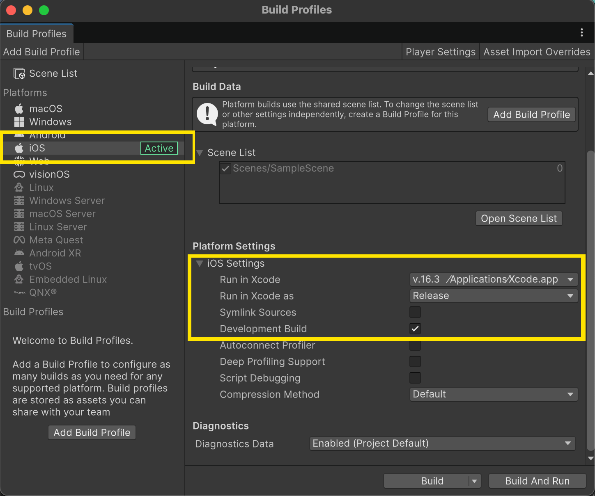
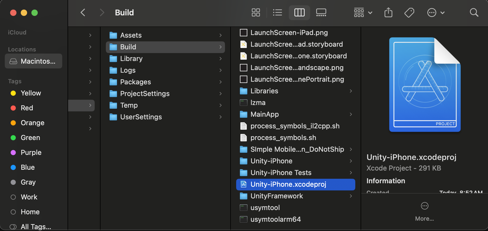
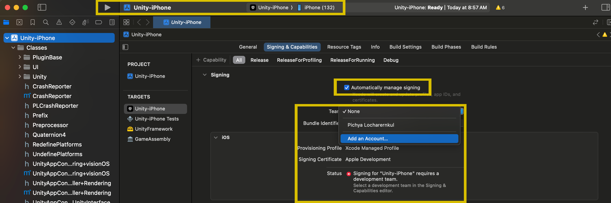

# Unity Design - Week 06

## Agenda

1. [IOS Publish](#Unity-Xcode-Mobile-Publish)  
2. [Mobile Touch Events](#UI-Touch-Events)  
3. [Unity AR Foundation](#Unity-AR-Foundation)  
4. [Mobile AR App Development](#Mobile-AR-App-Development)  
5. [Unity Vuforia SDK](#Unity-Vuforia-SDK)  
6. [Niantic ARDK](#Niantic-ARDK)

---

# Unity Publish from Unity 📱 

---

### Configure Unity Project for iOS
- **Switch Platform**:  


### Build Xcode Project from Unity
- **Build Xcode**:  


### Signing & Capabilities
- **Signing Certificate**:  


### Enable Developer Mode on iPhone & Trust Your Mac Device

```csharp

Settings → Privacy & Security → Developer Mode

Settings → General → VPN & Device Management

````

---

# Unity UI Touch Events 🚀

Touch interaction is the foundation of mobile gameplay and interactive applications.  
Unity supports touch input for both **UI elements (Canvas-based)** and **3D scene objects (GameObjects with Colliders)**.

---

## 👆 Basic UI Touch EventSystem

Attach a script implementing Unity’s event interfaces to any UI element.  

### Example: Tap, Hold, and Drag

```csharp
using UnityEngine;
using UnityEngine.EventSystems;

public class UIDragObject : MonoBehaviour, IBeginDragHandler, IDragHandler, IEndDragHandler
{
    private RectTransform rectTransform;

    void Awake()
    {
        rectTransform = GetComponent<RectTransform>();
    }

    public void OnBeginDrag(PointerEventData eventData)
    {
        Debug.Log("Drag started");
    }

    public void OnDrag(PointerEventData eventData)
    {
        rectTransform.anchoredPosition += eventData.delta;
    }

    public void OnEndDrag(PointerEventData eventData)
    {
        Debug.Log("Drag ended");
    }
}
````

Attach this script to a UI element with a `GraphicRaycaster`.

---

## ✋ Low-Level Touch API (Custom Gestures)

Use Unity’s `Input.touches` array for full gesture control and multi-touch.

```csharp
using UnityEngine;

public class TouchPhaseReader : MonoBehaviour
{
    void Update()
    {
        if (Input.touchCount > 0)
        {
            Touch t = Input.GetTouch(0);

            switch (t.phase)
            {
                case TouchPhase.Began:
                    Debug.Log("Touch began at: " + t.position);
                    break;
                case TouchPhase.Moved:
                    Debug.Log("Touch moved to: " + t.position);
                    break;
                case TouchPhase.Ended:
                    Debug.Log("Touch ended at: " + t.position);
                    break;
            }
        }
    }
}
```

---

## 💨 Swipe Detection (Direction-Based)

Detect fast directional swipes by comparing start and end positions.

```csharp
using UnityEngine;

public class SwipeDetector : MonoBehaviour
{
    private Vector2 startTouchPos;
    private Vector2 endTouchPos;
    public float swipeThreshold = 100f; // Minimum distance in pixels

    void Update()
    {
        if (Input.touchCount == 0) return;

        Touch touch = Input.GetTouch(0);

        if (touch.phase == TouchPhase.Began)
        {
            startTouchPos = touch.position;
        }
        else if (touch.phase == TouchPhase.Ended)
        {
            endTouchPos = touch.position;
            Vector2 swipeDelta = endTouchPos - startTouchPos;

            if (swipeDelta.magnitude > swipeThreshold)
            {
                float x = swipeDelta.x;
                float y = swipeDelta.y;

                if (Mathf.Abs(x) > Mathf.Abs(y))
                {
                    if (x > 0) Debug.Log("Swipe Right");
                    else Debug.Log("Swipe Left");
                }
                else
                {
                    if (y > 0) Debug.Log("Swipe Up");
                    else Debug.Log("Swipe Down");
                }
            }
        }
    }
}
```

---

## 🧭 Pan Gesture (Continuous Drag Movement)

Panning is similar to dragging, but applies to continuous movement (e.g., moving a camera or large map).

```csharp
using UnityEngine;

public class PanGesture : MonoBehaviour
{
    private Vector2 lastPanPosition;
    private bool isPanning;

    void Update()
    {
        if (Input.touchCount == 1)
        {
            Touch touch = Input.GetTouch(0);

            if (touch.phase == TouchPhase.Began)
            {
                lastPanPosition = touch.position;
                isPanning = true;
            }
            else if (touch.phase == TouchPhase.Moved && isPanning)
            {
                Vector2 delta = touch.position - lastPanPosition;
                transform.Translate(-delta.x * 0.01f, -delta.y * 0.01f, 0);
                lastPanPosition = touch.position;
            }
            else if (touch.phase == TouchPhase.Ended)
            {
                isPanning = false;
            }
        }
    }
}
```

---

## 🤏 Pinch Zoom (Two-Finger Gesture)

Pinching adjusts zoom level based on the distance between two fingers.

```csharp
using UnityEngine;

public class PinchZoom : MonoBehaviour
{
    public Camera cam;
    public float zoomSpeed = 0.1f;

    void Update()
    {
        if (Input.touchCount == 2)
        {
            Touch touch0 = Input.GetTouch(0);
            Touch touch1 = Input.GetTouch(1);

            Vector2 prevTouch0 = touch0.position - touch0.deltaPosition;
            Vector2 prevTouch1 = touch1.position - touch1.deltaPosition;

            float prevMagnitude = (prevTouch0 - prevTouch1).magnitude;
            float currentMagnitude = (touch0.position - touch1.position).magnitude;

            float difference = currentMagnitude - prevMagnitude;

            cam.fieldOfView -= difference * zoomSpeed;
            cam.fieldOfView = Mathf.Clamp(cam.fieldOfView, 20f, 100f);
        }
    }
}
``` 

---

## 🎲 Interacting with 3D Scene Objects (Touch Raycast)

To let users **touch 3D models** (like tapping a cube to select it or dragging it around), use **Raycasting** from the camera to the 3D scene.

### Example: Tap 3D Object

```csharp
using UnityEngine;

public class Touch3DSelector : MonoBehaviour
{
    void Update()
    {
        if (Input.touchCount > 0 && Input.GetTouch(0).phase == TouchPhase.Began)
        {
            Touch touch = Input.GetTouch(0);
            Ray ray = Camera.main.ScreenPointToRay(touch.position);
            RaycastHit hit;

            if (Physics.Raycast(ray, out hit))
            {
                Debug.Log("Touched object: " + hit.transform.name);
                hit.transform.GetComponent<Renderer>().material.color = Random.ColorHSV(); // Example: change color
            }
        }
    }
}
```

---

## ✋ Dragging 3D Objects with Touch

Allow users to move a 3D object across the screen by continuously updating its position based on touch input.

```csharp
using UnityEngine;

public class TouchDrag3D : MonoBehaviour
{
    private Transform selectedObject;
    private Vector3 offset;

    void Update()
    {
        if (Input.touchCount == 0) return;

        Touch touch = Input.GetTouch(0);
        Ray ray = Camera.main.ScreenPointToRay(touch.position);
        RaycastHit hit;

        if (touch.phase == TouchPhase.Began)
        {
            if (Physics.Raycast(ray, out hit))
            {
                selectedObject = hit.transform;
                Vector3 touchPoint = ray.GetPoint(hit.distance);
                offset = selectedObject.position - touchPoint;
            }
        }
        else if (touch.phase == TouchPhase.Moved && selectedObject)
        {
            Plane plane = new Plane(Camera.main.transform.forward * -1, selectedObject.position);
            float dist;
            if (plane.Raycast(ray, out dist))
            {
                Vector3 worldPos = ray.GetPoint(dist);
                selectedObject.position = worldPos + offset;
            }
        }
        else if (touch.phase == TouchPhase.Ended)
        {
            selectedObject = null;
        }
    }
}
```

---

# Unity AR Foundation (v6.2) 🚀

A guide and tutorial for getting started with **Unity AR Foundation 6.2.0**, including setup, core concepts, sample workflows, and tips & best practices.

---

## 🎯 What is AR Foundation?

AR Foundation is Unity’s cross-platform framework for building augmented reality (AR) applications. It provides common interfaces for AR features, and delegates implementation to platform-specific provider packages (e.g. ARCore for Android, ARKit for iOS). This lets you write once in Unity and target multiple AR-capable platforms. :contentReference[oaicite:0]{index=0}

Features AR Foundation supports include:  
- Session management (start, stop, pause AR) :contentReference[oaicite:1]{index=1}  
- Device pose / camera tracking :contentReference[oaicite:2]{index=2}  
- Plane detection (e.g. floor, walls) :contentReference[oaicite:3]{index=3}  
- Image & object tracking :contentReference[oaicite:4]{index=4}  
- Anchors (fixed points in real world space) :contentReference[oaicite:5]{index=5}  
- Raycasts against tracked surfaces or feature points :contentReference[oaicite:6]{index=6}  
- Light estimation, occlusion, environment probes, meshing (depending on platform) :contentReference[oaicite:7]{index=7}  

---

## ✅ Official Unity Documentation

-[AR Fopundation Docs](https://docs.unity3d.com/Packages/com.unity.xr.arfoundation%406.2/manual/index.html)

---
## 🧰 Requirements & Setup

Before you begin, make sure you have:

- Unity 2021 LTS or newer (preferably one of the more recent LTS releases for compatibility and stability).  
- AR device(s) to test on (Android with ARCore, iOS device with ARKit, etc.).  
- Unity XR Plugin architecture. You’ll need AR Foundation plus provider/plug-in package(s) for your target platforms. :contentReference[oaicite:8]{index=8}  

### Installing Packages

1. Open **Unity → Window → Package Manager**.  
2. Add the **AR Foundation** package (v6.2.0).  
3. Also install the provider plug-in(s) matching your target platform(s), for example:  
   - Google ARCore XR Plug-in (for Android)  
   - Apple ARKit XR Plug-in (for iOS)  
   - OpenXR, visionOS, etc. :contentReference[oaicite:9]{index=9}  

4. Make sure in **Project Settings → XR Plug-in Management** the correct plug-in(s) are enabled for each build target (Android, iOS).  

---

## 🔍 Quick Start Tutorial

Here’s a typical workflow to get a basic AR scene up and running, including plane detection and simple raycasting.

### 1. Create a new AR Scene

- In Unity, create a new Scene (e.g. `ARScene`).  
- Set up scene components:

  - Add an **AR Session** game object: this manages the AR lifecycle.  
  - Add an **AR Session Origin**: handles translating AR space into Unity scene space (usually has a Camera child for AR rendering).  
  - Under the Session Origin, add an **AR Camera** (with AR Camera component, often setup automatically).  

### 2. Enable Plane Detection

- On the AR Session Origin or a manager GameObject, add an **ARPlaneManager** component.  
- Configure detection mode (horizontal, vertical, or both).  

### 3. Add Raycasting to Place Objects

- Add an **ARRaycastManager** component.  
- Create a UI or script so that when the user taps (or touches) the screen, you perform a raycast from the touch position into the AR world. If the raycast hits a detected plane, instantiate/place a prefab (e.g. a cube) at that point.

```csharp
using UnityEngine;
using UnityEngine.XR.ARFoundation;
using UnityEngine.XR.ARSubsystems;
using System.Collections.Generic;

public class ARTouchPlacement : MonoBehaviour
{
    [SerializeField]
    private GameObject placeablePrefab;

    private ARRaycastManager raycastManager;
    private List<ARRaycastHit> hitResults = new List<ARRaycastHit>();

    void Awake()
    {
        raycastManager = GetComponent<ARRaycastManager>();
    }

    void Update()
    {
        if (Input.touchCount > 0)
        {
            Touch touch = Input.GetTouch(0);
            if (touch.phase == TouchPhase.Began)
            {
                if (raycastManager.Raycast(touch.position, hitResults, TrackableType.Planes))
                {
                    Pose hitPose = hitResults[0].pose;
                    Instantiate(placeablePrefab, hitPose.position, hitPose.rotation);
                }
            }
        }
    }
}
````

### 4. Build & Test on Device

* Switch platform in Unity Build Settings to **Android** or **iOS**.
* Make sure the provider plug-in is enabled and you have required permissions (camera, etc.).
* Build & run on your device.
* Test detecting planes, placing objects via touch, and moving around.

---

## ⚙ Supported Features & Platform Differences

Some features are only available on certain platforms. The core features like session, device tracking, plane detection, camera, raycasting are broadly supported. Others (object tracking, meshing, environment probes, occlusion, etc.) may require specific hardware / platform. 

Unity’s XR Simulation (inside the Editor) can help emulate some aspects during development, but usually you'll need real devices to test full AR functionality. 


---

# Mobile AR Development Unity Learn Module

https://learn.unity.com/pathway/mobile-ar-development?version=2022.3
 
---

# Unity Vuforia SDK 🔍✨

Vuforia is a leading **Augmented Reality (AR) SDK** for Unity that allows developers to recognize images, objects, and environments, then overlay interactive 3D content. It’s widely used for AR apps in education, retail, training, and entertainment.

---

## 🎯 What is Vuforia?
Vuforia is an **AR engine** that integrates with Unity to provide:
- 📷 **Image Target Recognition** → Detect and augment 2D images.  
- 🛠 **Model Target Tracking** → Recognize 3D objects.  
- 🌍 **Ground Plane** → Place AR objects on real-world surfaces.  
- 🎭 **VUMarks** → Custom markers (like QR codes but stylized).  
- 🕹 **Virtual Buttons** → Trigger actions with physical marker interactions.  
- 🧩 **Multi-targets** → Track multiple objects at once.  

---

## 🛠 Requirements
- Unity **2021 LTS or newer**.  
- [Vuforia Engine SDK](https://developer.vuforia.com/downloads/sdk) installed in Unity.  
- A supported device (Android/iOS) with a working camera.  
- [Vuforia Developer Account](https://developer.vuforia.com/) (for license keys).  

---

## 📥 Installation

1. **Enable Vuforia in Unity**  
   - Go to: `Edit → Project Settings → Player → XR Settings`.  
   - Enable **Vuforia Augmented Reality Support**.  

2. **Get a License Key**  
   - Sign up at [Vuforia Developer Portal](https://developer.vuforia.com/).  
   - Create a new project → Copy your **App License Key**.  
   - Paste it into: `Vuforia Configuration → App License Key`.  

3. **Import Vuforia SDK**  
   - Via Unity **Package Manager** or `.unitypackage` download from the Vuforia portal.  

---

## 🚀 Quick Start Tutorial

### 1. Setup AR Camera
- Delete the default Unity **Main Camera**.  
- Add a **Vuforia AR Camera** (GameObject → Vuforia Engine → AR Camera).  
- In **AR Camera Inspector**, paste your License Key.  

### 2. Add an Image Target
1. Go to [Vuforia Target Manager](https://developer.vuforia.com/target-manager).  
2. Upload a reference image → Generate a **Database**.  
3. Download the `.unitypackage` and import into Unity.  
4. In Unity:  
   - Add **GameObject → Vuforia Engine → Image Target**.  
   - Assign your imported database + image.  

### 3. Place 3D Content
- Drag a 3D model (e.g., Cube, Character prefab) as a **child of the Image Target**.  
- When the target is detected via camera, the object appears on top of it.  

### 4. Build & Test
- Switch platform: **Android/iOS**.  
- Build & run on a device.  
- Point your camera at the image target → Watch your AR content appear.  

---

## 🧩 Example Script: Rotate Object on Target
```csharp
using UnityEngine;
using Vuforia;

public class RotateOnTarget : MonoBehaviour, ITrackableEventHandler
{
    private TrackableBehaviour trackable;

    void Start()
    {
        trackable = GetComponent<TrackableBehaviour>();
        if (trackable) trackable.RegisterTrackableEventHandler(this);
    }

    public void OnTrackableStateChanged(
        TrackableBehaviour.Status prev, TrackableBehaviour.Status newStatus)
    {
        if (newStatus == TrackableBehaviour.Status.DETECTED ||
            newStatus == TrackableBehaviour.Status.TRACKED)
        {
            // Target found → Start rotating
            StartCoroutine(Rotate());
        }
    }

    private System.Collections.IEnumerator Rotate()
    {
        while (true)
        {
            transform.Rotate(Vector3.up * 50 * Time.deltaTime);
            yield return null;
        }
    }
}
````

✅ This script rotates a 3D object whenever the target image is detected.

---

## ⚡ Advanced Features

* **Ground Plane** → Place objects on horizontal surfaces without markers.
* **Model Targets** → Recognize and augment real 3D products.
* **VUMarks** → Brandable AR markers (customized QR-like codes).
* **Virtual Buttons** → Add interactivity by defining button zones on targets.

---

## 💡 Best Practices

* Use **high-contrast, non-repetitive images** for targets.
* Test target ratings in the Vuforia Target Manager (⭐ stronger = better).
* Optimize 3D assets (low poly, compressed textures) for mobile performance.
* Handle lost tracking gracefully (fade or pause AR content).
* Always test on real devices — AR is hardware dependent.

---

## 📚 Resources

* [Vuforia Developer Portal](https://developer.vuforia.com/)
* [Unity Vuforia Documentation](https://library.vuforia.com/)
* [Vuforia Sample Repository](https://github.com/PTCInc/VuforiaEngineSamples)
* [Unity AR Foundation vs Vuforia](https://unity.com/partners/vuforia)

---

# Niantic ARDK 🌍✨

Niantic’s **Augmented Reality Developer Kit (ARDK)** empowers developers to build **multiplayer, context-aware AR experiences** in Unity. With ARDK, you can blend the real world with digital content, leveraging Niantic’s expertise in AR (Pokémon GO, Peridot, Pikmin Bloom).  

---

## 🎯 What is ARDK?
Niantic ARDK provides advanced AR capabilities in Unity:
- 🧩 **Semantic Segmentation** → Understand real-world surfaces (sky, ground, buildings, people).  
- 🔍 **Meshing** → Scan & generate meshes of your environment in real-time.  
- 🌐 **Multiplayer** → Share AR experiences with multiple users via Lightship Networking.  
- 🕹 **Occlusion** → Make digital objects appear naturally behind real-world objects.  
- 🧭 **Persistent AR** → Save and reload AR content at specific real-world locations.  

---

## 🛠 Requirements
- Unity **2021 LTS or newer** (recommended).  
- AR-capable device (iOS with ARKit, Android with ARCore).  
- [Niantic Lightship Account](https://lightship.dev/) (for API keys).  
- ARDK package installed in Unity.  

---

## 📥 Installation

### 1. Create a Lightship Account
- Sign up at [lightship.dev](https://lightship.dev/).  
- Create an app and retrieve your **API key**.  

### 2. Install ARDK
1. Open Unity → `Window → Package Manager`.  
2. Click the **+** icon → *Add package from Git URL*.  
   ```text
   https://github.com/niantic-lightship/ardk-unity-package.git
````

3. Import samples for example scenes.

### 3. Configure API Key

* Go to: `Edit → Project Settings → Niantic Lightship`.
* Paste your API key in the **API Key field**.

---

## 🚀 Quick Start Tutorial

### 1. Create a New AR Scene

* Delete the default **Main Camera**.
* Add an **AR Session** prefab from ARDK (handles lifecycle).
* Add an **AR Camera** (child of AR Session).

### 2. Add Meshing

* Add **AR Mesh Manager** to your AR Session Origin.
* When running on device, ARDK will generate a mesh of your environment in real-time.

### 3. Place Objects with Tap

Example script to place an object when the user taps on a surface:

```csharp
using Niantic.ARDK.AR;
using Niantic.ARDK.AR.Camera;
using Niantic.ARDK.AR.ARSessionEventArgs;
using Niantic.ARDK.Extensions;
using UnityEngine;

public class TapToPlace : MonoBehaviour
{
    public GameObject prefab;
    private IARSession _session;

    void Start()
    {
        ARSessionFactory.SessionInitialized += OnSessionInitialized;
    }

    private void OnSessionInitialized(AnyARSessionInitializedArgs args)
    {
        _session = args.Session;
    }

    void Update()
    {
        if (_session == null || Input.touchCount == 0) return;

        Touch touch = Input.GetTouch(0);
        if (touch.phase != TouchPhase.Began) return;

        var hitResults = _session.CurrentFrame.HitTest
        (
            Camera.main.pixelWidth,
            Camera.main.pixelHeight,
            touch.position
        );

        if (hitResults.Count > 0)
        {
            var hit = hitResults[0];
            Instantiate(prefab, hit.WorldTransform.ToPosition(), hit.WorldTransform.ToRotation());
        }
    }
}
```

✅ This script spawns a prefab where the user taps, anchored to real-world surfaces detected by ARDK.

---

## ⚡ Advanced Features

* **Semantic Segmentation** → Mask out sky, ground, buildings, water, etc.
* **Occlusion** → Hide AR objects behind real-world objects.
* **Persistent AR** → Store anchors to return to the same AR scene later.
* **Shared Multiplayer AR** → Niantic’s peer-to-peer networking system.

---

## 🧪 Best Practices

* Always test on real devices (Editor play mode won’t simulate full AR).
* Optimize assets for mobile AR (low poly, compressed textures).
* Use **anchors** to keep AR objects stable.
* Handle **tracking loss** gracefully.
* Limit network payloads for smoother multiplayer AR.

---

## 📚 Resources

* [Niantic Lightship Docs](https://lightship.dev/docs/)
* [ARDK Unity API Reference](https://lightship.dev/docs/ardk/)
* [Lightship GitHub Samples](https://github.com/niantic-lightship/ardk-unity-samples)
* [Community Forum](https://lightship.dev/forums/)

---

## ✅ Summary

With Niantic’s ARDK you can:

* Build AR experiences that understand the real world (meshes, segmentation).
* Create **multiplayer shared AR sessions**.
* Make AR objects behave naturally with occlusion.
* Deliver persistent, location-based AR apps.

---
